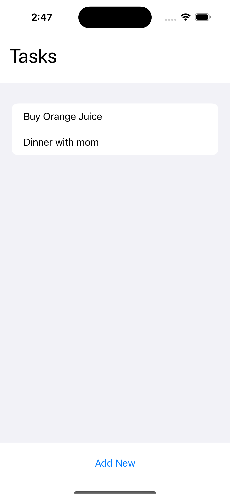
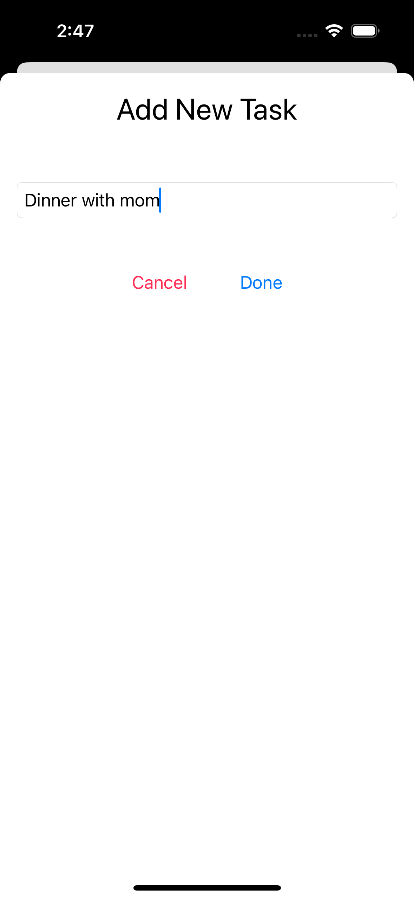

# TodoApp-CombineSwiftUI

## Overview

TodoApp-CombineSwiftUI is a simple to-do list application built using SwiftUI and Combine. This project demonstrates how to use reactive programming principles to manage state and handle user interactions in a SwiftUI-based app.

## Features

- Display a list of tasks
- Add new tasks with validation
- Reactive state management using Combine

## Usage

- Launch the app.
- View the list of tasks.
- Tap the "Add New" button to add a new task.
- Enter the task description and tap "Done" to add the task to the list.
- Tap "Cancel" to dismiss the add task view without adding a task.

<table>
  <tr>
    <td></td>
    <td></td>
  </tr>
</table>

 

## Code Structure

- TaskListViewModel.swift: Contains the TaskListViewModel class that manages the list of tasks and handles adding new tasks using Combine.
- ContentView.swift: The main view displaying the list of tasks and a button to add new tasks.
- AddTaskView.swift: A view for entering and adding new tasks.

## Author

Negin Zahedi
